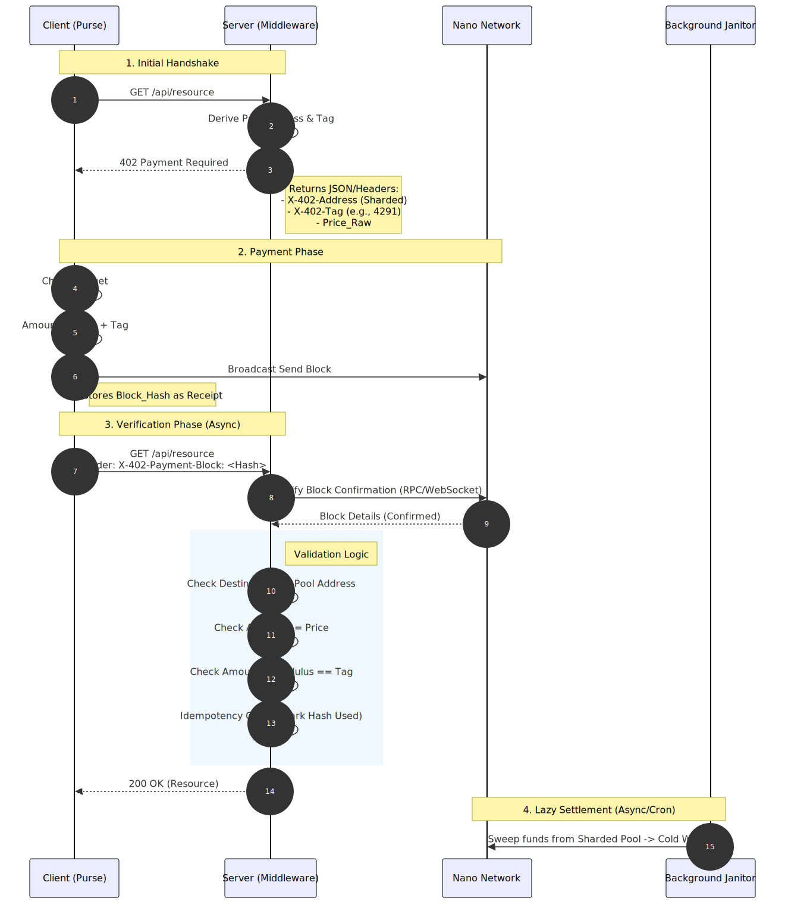
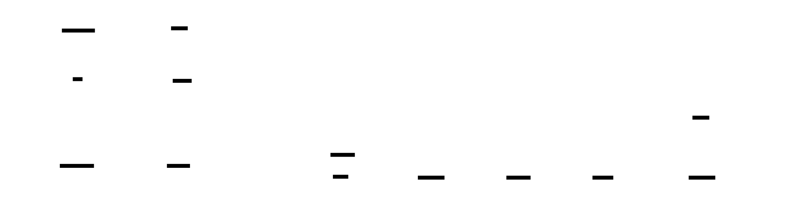

# x402.NanoSession Architecture Diagrams

These diagrams illustrate the core workflows and logic of the x402.NanoSession (Rev 1) protocol, rendered offline using D2.

## 1. Protocol Sequence Flow

This diagram shows the complete lifecycle of a resource request, from the initial 402 challenge to the asynchronous verification and final lazy settlement.

## 2. Sharding & Tagging Logic

This flowchart visualizes how the Server deterministically maps a Session and Request to a specific Nano Address and Amount.

## 3. Client (Purse) State Machine

This diagram details the decision-making process within the Client Agent (Purse).

