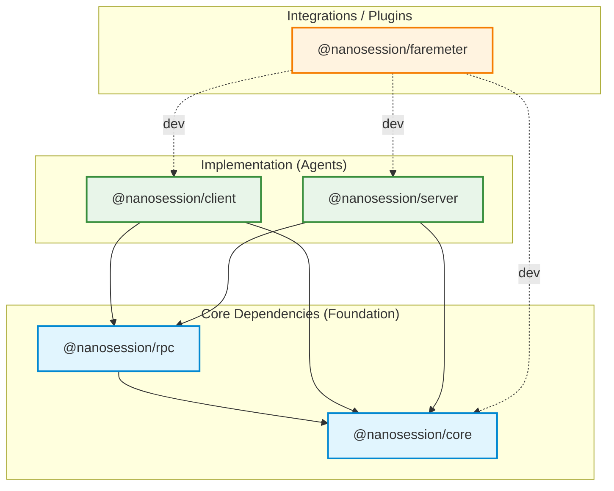

```mermaid
graph TD
    %% Tiers definition
    subgraph "Core Dependencies (Foundation)"
        Core["@nanosession/core"]
        RPC["@nanosession/rpc"]
    end

    subgraph "Implementation (Agents)"
        Server["@nanosession/server"]
        Client["@nanosession/client"]
    end

    subgraph "Integrations / Plugins"
        Faremeter["@nanosession/faremeter"]
    end

    %% Solid lines for dependencies
    RPC --> Core
    Client --> Core
    Client --> RPC
    Server --> Core
    Server --> RPC

    %% Dotted lines for devDependencies
    Faremeter -.->|"dev"| Client
    Faremeter -.->|"dev"| Server
    Faremeter -.->|"dev"| Core

    classDef core fill:#e1f5fe,stroke:#0288d1,stroke-width:2px;
    classDef agent fill:#e8f5e9,stroke:#388e3c,stroke-width:2px;
    classDef plugin fill:#fff3e0,stroke:#f57c00,stroke-width:2px;

    class Core,RPC core;
    class Server,Client agent;
    class Faremeter plugin;
```
