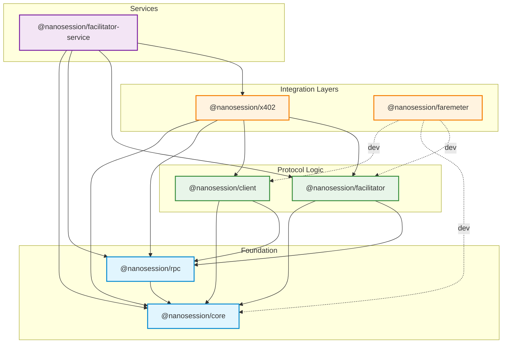

> [!NOTE]
> The Mermaid graph below is not built locally; it is intended to be viewed on GitHub where it will render automatically.

```mermaid
graph TD
    %% Tiers definition
    subgraph "Foundation"
        Core["@nanosession/core"]
        RPC["@nanosession/rpc"]
    end

    subgraph "Protocol Logic"
        Client["@nanosession/client"]
        Facilitator["@nanosession/facilitator"]
    end

    subgraph "Integration Layers"
        X402["@nanosession/x402"]
        Faremeter["@nanosession/faremeter"]
    end

    subgraph "Services"
        Service["@nanosession/facilitator-service"]
    end

    %% Solid lines for dependencies
    RPC --> Core
    Client --> Core
    Client --> RPC
    Facilitator --> Core
    Facilitator --> RPC
    X402 --> Core
    X402 --> RPC
    X402 --> Client
    X402 --> Facilitator
    Service --> Core
    Service --> RPC
    Service --> Facilitator
    Service --> X402

    %% Dotted lines for devDependencies
    Faremeter -.->|"dev"| Client
    Faremeter -.->|"dev"| Core
    Faremeter -.->|"dev"| Facilitator

    classDef foundation fill:#e1f5fe,stroke:#0288d1,stroke-width:2px;
    classDef logic fill:#e8f5e9,stroke:#388e3c,stroke-width:2px;
    classDef integration fill:#fff3e0,stroke:#f57c00,stroke-width:2px;
    classDef service fill:#f3e5f5,stroke:#7b1fa2,stroke-width:2px;

    class Core,RPC foundation;
    class Client,Facilitator logic;
    class X402,Faremeter integration;
    class Service service;
```
